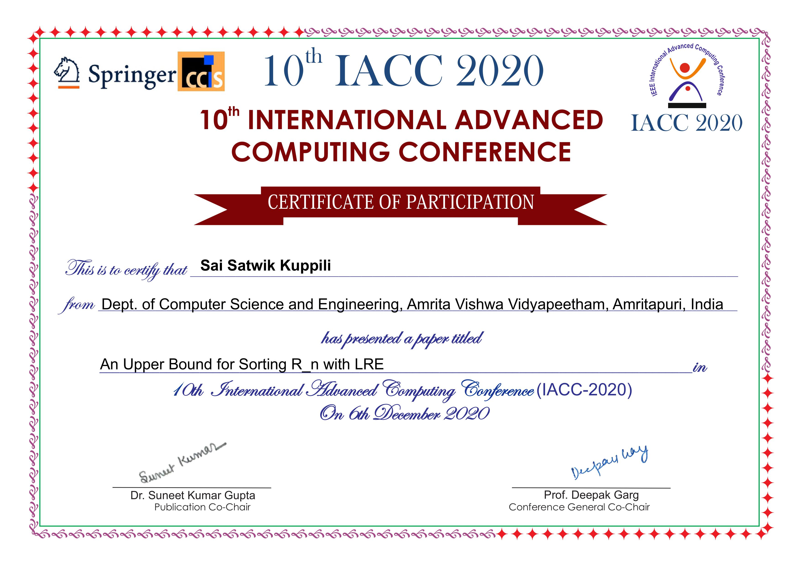
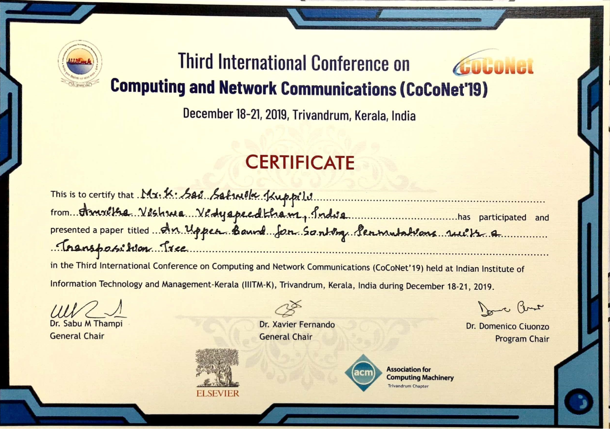
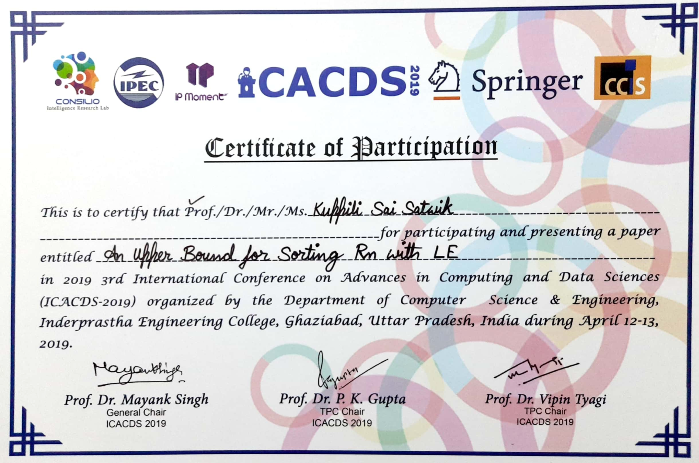
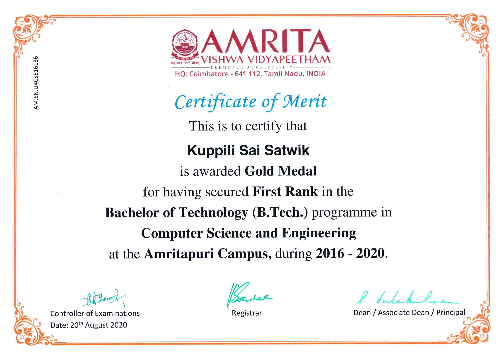
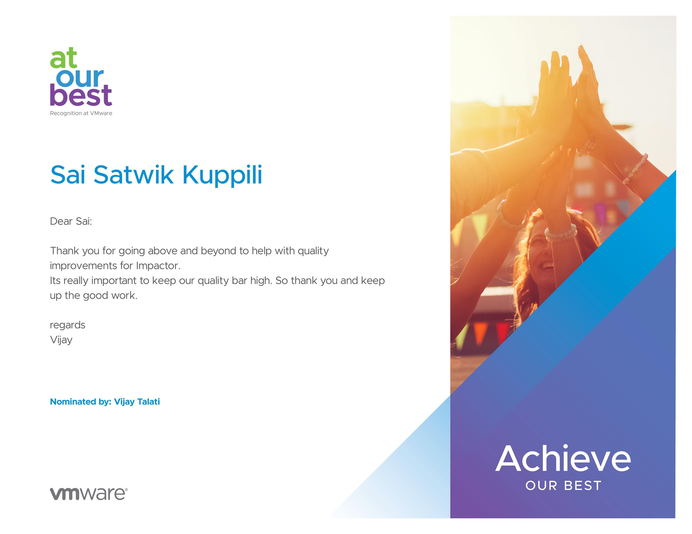
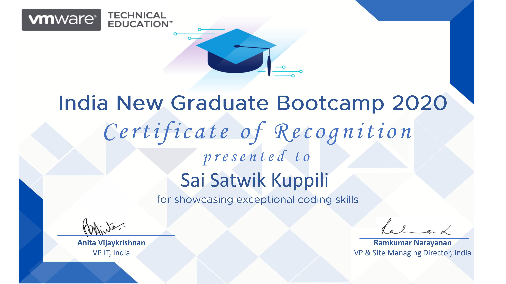
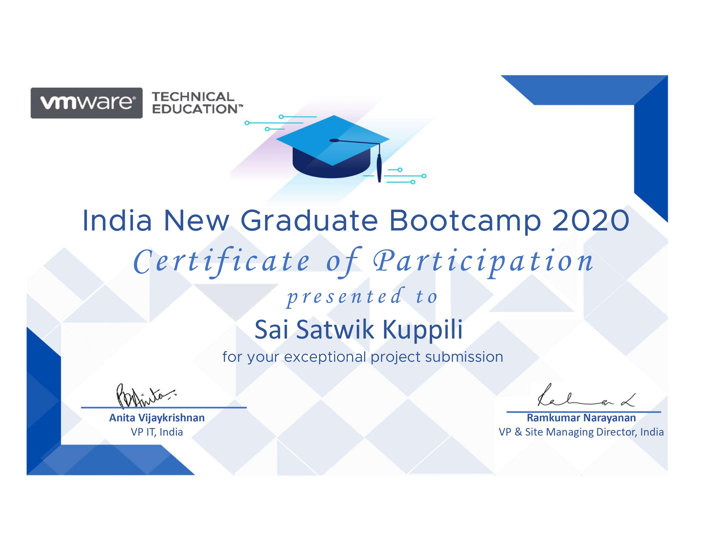
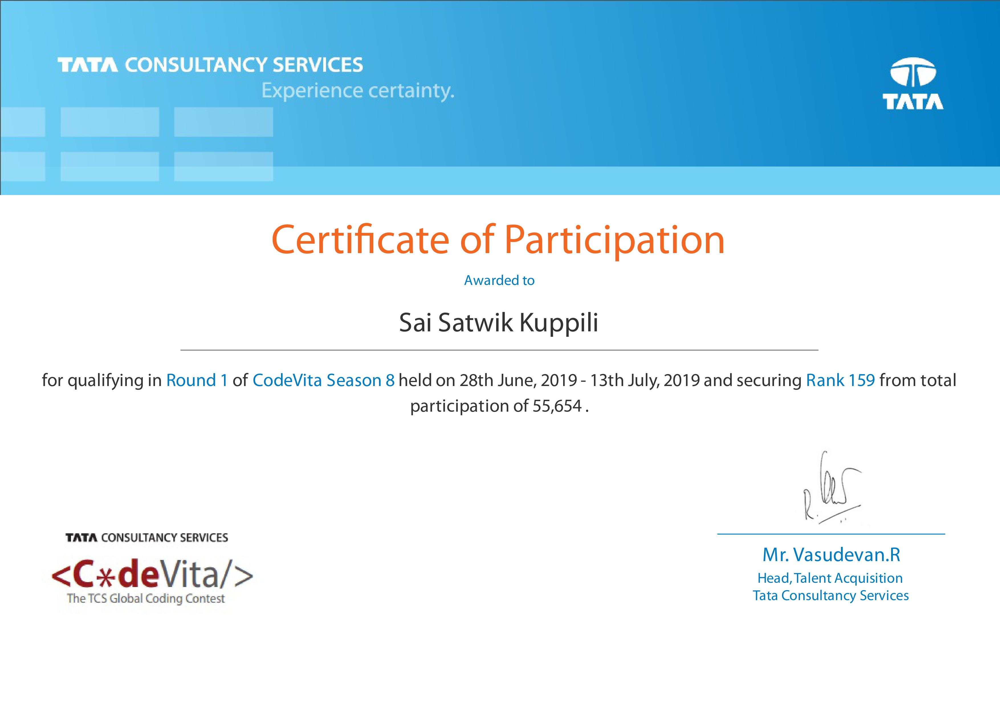

# Career Portfolio
---
## Patents and Publications

#### Database-Platform-Agnostic Processing of Natural Language Queries

Inventors: Priyanka Luthra, **Sai Satwik Kuppili**, Shrinivas Sharad Parashar, Sarat Chandra Annadata.\
Application No.: 17/499,901\
Filed on: October 13, 2021\
Grant: Pending

---
#### An Upper Bound for Sorting Rn with LRE

Authors: **Sai Satwik Kuppili**, Bhadrachalam Chitturi, Venkata Vyshnavi Ravella, C.K. Phani Datta\
Conference: 10th International Advance Computing Conference accepted this paper for Oral Presentation and publication in **Springer CCIS Lecture Notes** \
Link: [An Upper Bound for Sorting Rn with LRE](https://doi.org/10.1007/978-981-16-0404-1_21)

---
#### Exact Upper Bound For Sorting Rn with LE

Authors: **Sai Satwik Kuppili**, Bhadrachalam Chitturi/
Journal: **Discrete Mathematics and Algorithms Journal** Volumne 12, Issue 03\
Link: [Exact Upper Bound For Sorting Rn with LE](https://doi.org/10.1142/S1793830920500330)

---
#### An Upper Bound For Sorting Permutations With A Transposition Tree

Authors: Devika K Das, Bhadrachalam Chitturi, **Sai Satwik Kuppili**\
Conference: 3rd International Conference on Computing and Network Communications accepted this paper for Oral Presentation and publication in **Elsevier Procedia Computer Science Journal**.\
Link: [An Upper Bound For Sorting Permutations With A Transposition Tree](https://doi.org/10.1016/j.procs.2020.04.008)

---
#### An Upper Bound for sorting Rn with LE

Authors: **Sai Satwik Kuppili**, Bhadrachalam Chitturi, Srinath T\
Conference: 3rd International Conference On Advances In Computing And Data Sciences, India accepted my paper for Oral Presentation and publication in **Springer CCIS Lecture Notes**\
Link: [An Upper Bound for sorting Rn with LE](https://doi.org/10.1007/978-981-13-9942-8_23)

---
## Awards

### Gold Medal

Gold Medalist in Computer Science and Engineering (2016-2020) at Amrita University.

---
### Achieve Our Award

Received Achieve Our Award for delivering best quality features on time and keeping quality bar high.

---
### Best Paper Award

Received Best Paper Award in Computing Track out of 306 accepted papers at CoCoNet-2019 Conference.

---
### R&D best coder award

Received R&D best coder award for showing exceptional coding skills at 2020 India New Graduate Bootcamp.

---
### R&D best project award

My team won the R&D best project award for exceptional project submission on "Bootcamp Management System" at 2020 India New Graduate Bootcamp conducted by VMware Technical Education.

---
### ACM-ICPC 2019

My team selected for ACM-ICPC 2019 Kanpur Regional.

---
### TCS CodeVita Session 8

Secured rank 159 from total participation of 55,654 in TCS CodeVita Session 8.

---

